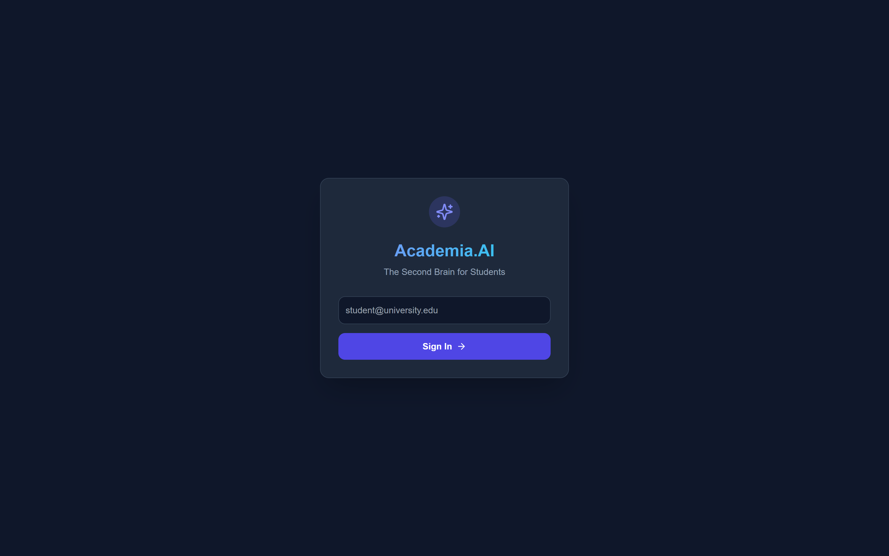
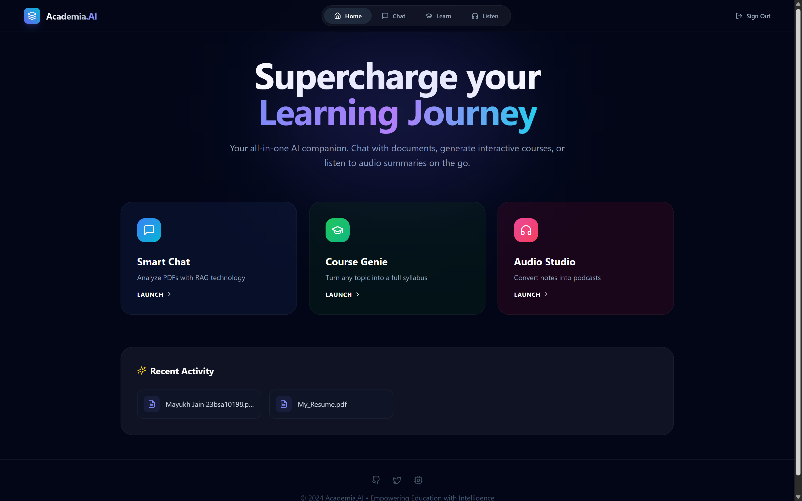
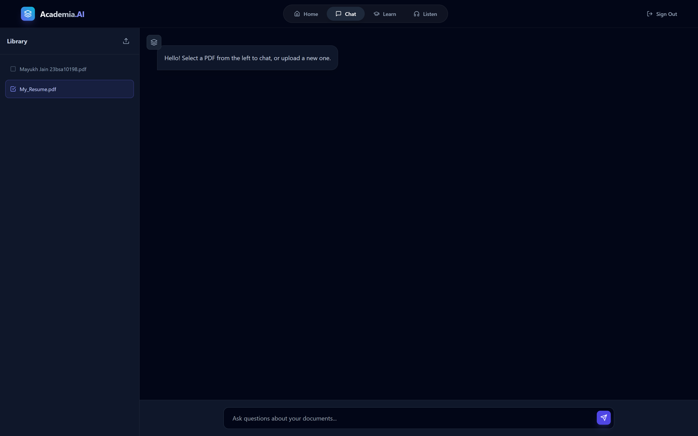
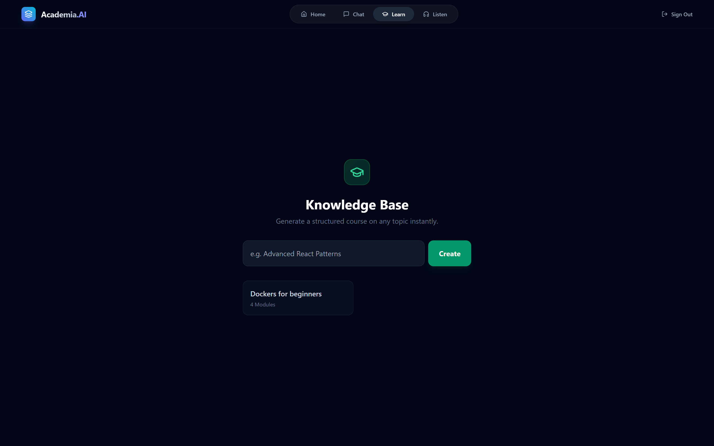
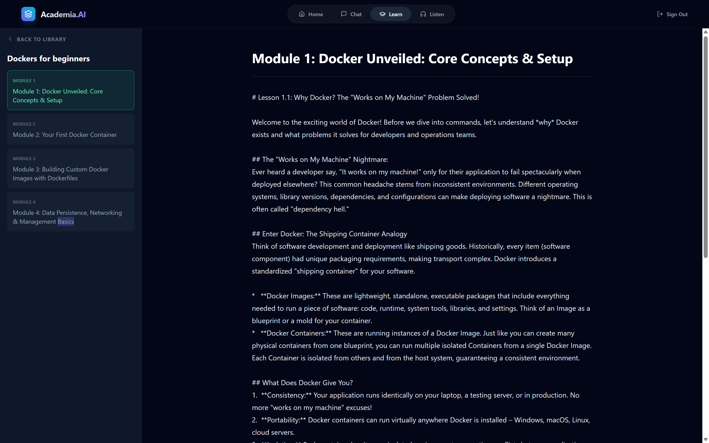
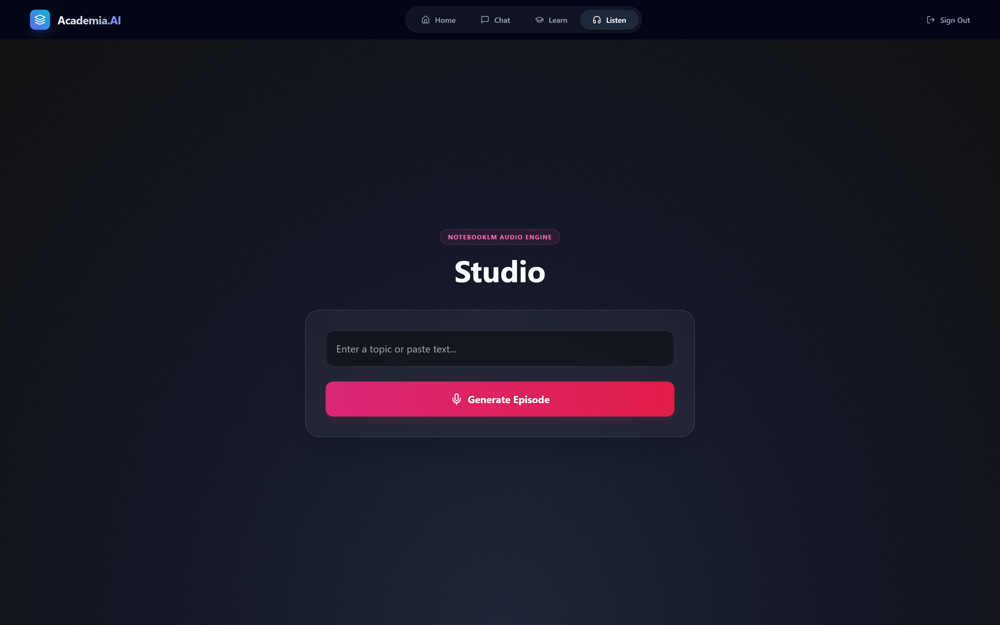
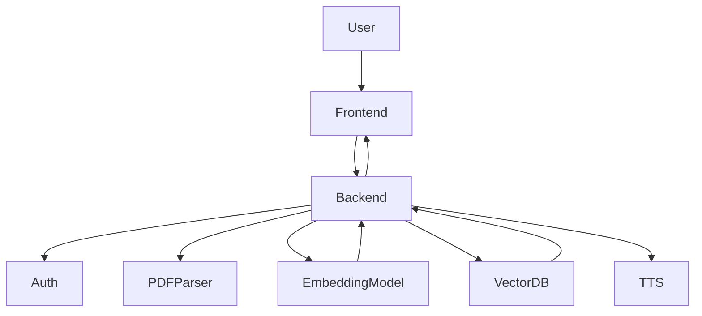

# 🎓 Academia.AI

**AI-Powered Research, Learning & Knowledge Transformation Platform**

🔗 **Live Demo:** [https://academia-ai-nu.vercel.app/](https://academia-ai-nu.vercel.app/)

---

## 🚀 Project Summary (Resume / Portfolio Ready)

**Academia.AI** is an end-to-end AI-driven learning platform that transforms static academic PDFs into **interactive chats**, **adaptive courses**, and **podcast-style audio discussions**.

Designed to enhance *just-in-time learning*, the platform leverages **Retrieval-Augmented Generation (RAG)** with **Google Gemini 1.5** to deliver accurate, citation-backed responses grounded entirely in user-provided documents.

Built with a modern full-stack architecture using **FastAPI**, **React (Vite)**, and **Supabase**, Academia.AI demonstrates strong expertise in **LLM integration**, **vector search**, **secure authentication**, and **scalable AI system design**.

---

## ✨ Key Highlights (Impact-Focused)

* 📄 Converted static PDFs into **context-aware AI conversations** using RAG
* 🧠 Implemented **multi-document semantic search** with pgvector embeddings
* 🎓 Built an **adaptive course generator** with quizzes and dynamic feedback loops
* 🎙️ Designed a **NotebookLM-style podcast engine** to convert research into dialogue-based audio
* 🔐 Implemented **secure authentication & user isolation** using Supabase Auth
* 📚 Persistent **personal knowledge library** for chats, courses, and podcasts
* ⚡ Delivered a responsive, animated UI using Tailwind CSS & Framer Motion

---

## 🧠 Core Features

### 🔐 Authentication & Personal Library

* Secure **email-based login system** powered by Supabase Auth
* User-specific document access and ownership validation
* All generated content (**chats, courses, podcasts**) is automatically saved
* Acts as a **personal AI knowledge vault** accessible across sessions

### 🔍 Context-Aware PDF Chat (RAG)

* Query multiple PDFs simultaneously
* Citation-grounded AI answers to reduce hallucinations
* Split-screen document reading and chat interface

### 🎓 CourseGenie – Adaptive Learning Engine

* Auto-generates structured syllabi for any topic
* Chapter-wise quizzes with AI-powered feedback
* Dynamically simplifies explanations based on learner responses

### 🎙️ AI Podcast Studio

* Converts research papers into two-person audio conversations
* Real-time audio visualizer
* Downloadable episodes for offline learning

### 📂 Smart Knowledge Library

* Centralized dashboard for all user-generated content
* Persistent storage of PDFs, conversations, courses, and podcasts
* Seamless resume-from-where-you-left experience

---

## 🛠️ Tech Stack

**Frontend**

* React.js (Vite)
* Tailwind CSS
* Framer Motion
* Lucide Icons

**Backend**

* FastAPI (Python 3.10+)
* Google Gemini 1.5 Flash
* PyPDF2 (PDF Parsing)
* Edge TTS (Audio Generation)

**Database & Infrastructure**

* Supabase (PostgreSQL + Auth)
* pgvector (Vector Embeddings for RAG)
* Vercel (Frontend Deployment)
* Hugging Face Spaces / Render (Backend)

---

## 🌐 Live Demo

🔗 **Academia.AI Web App:**
[https://academia-ai-nu.vercel.app/](https://academia-ai-nu.vercel.app/)

**Demo Capabilities:**

* Secure login & personalized dashboard
* Upload and chat with PDFs
* Generate AI-powered courses instantly
* Convert research into podcast-style audio
* Revisit saved content anytime from the library

---

## 📸 Screenshots

### 🔐 Login & Authentication

### 🔐 Hero Page

### 💬 Context-Aware PDF Chat

### 🎓 CourseGenie – Adaptive Learning

### 🎙️ AI Podcast Studio

---

## 🏗️ System Architecture

Academia.AI follows a **modular, scalable, full-stack architecture** designed for AI-powered document understanding and adaptive learning. The system integrates a modern React frontend with a FastAPI backend and a vector-enabled database to enable efficient **Retrieval-Augmented Generation (RAG)** workflows.

---

### 🔄 High-Level Flow

1. User signs in via **Supabase Authentication**
2. User uploads PDFs via the React frontend
3. Backend (FastAPI) extracts and preprocesses text
4. Embeddings are generated using **Google Gemini 1.5**
5. Embeddings are stored in **Supabase (PostgreSQL + pgvector)**
6. User queries trigger semantic search over stored vectors
7. Retrieved context is sent to Gemini for grounded response generation
8. Responses (chat, course, or podcast scripts) are saved to the user library
9. Optional audio is generated using **Edge TTS**

---

### 🧩 Architecture Diagram

---

## 👤 Author

**Mayukh Jain**
*Full-Stack Developer | AI & RAG Systems*

* 💼 **Portfolio:** [https://mayukhjain.vercel.app](https://mayukhjain.vercel.app)
* 🐙 **GitHub:** [https://github.com/Mayukh-Jain](https://github.com/Mayukh-Jain)

---

⭐ *If this project helped you, consider giving it a star!*
